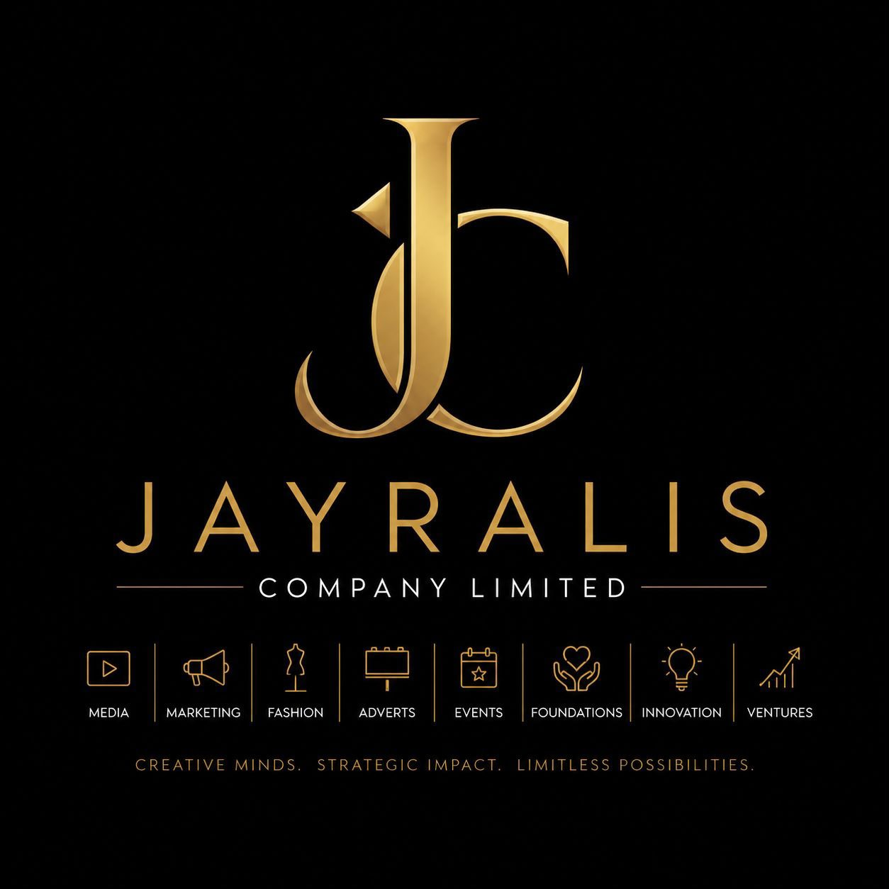

<div align="center">



# Jayralis Company Limited

### Vision &bull; Opportunity &bull; Growth

[](https://nextjs.org/)
[](https://www.typescriptlang.org/)
[](https://tailwindcss.com/)
[]()

**A dynamic, Nigerian-rooted holding company headquartered in Abuja — dedicated to creating sustainable value through strategic investments and innovation.**

[Live Preview](#) &bull; [About](#about) &bull; [Portfolio](#portfolio) &bull; [Contact](#contact)

</div>

---

## About Jayralis

Jayralis Company Limited is a dynamic, Nigerian-rooted holding company headquartered in Abuja. Dedicated to creating sustainable value through strategic investments and innovation, the company builds and nurtures a diversified portfolio of independent subsidiaries spanning media, fashion, advertising, events, philanthropy, and ventures.

Operating as a central holding company, Jayralis oversees high-level strategy, manages overarching finances, and provides shared legal and technological resources to its portfolio. This robust support structure empowers each subsidiary to operate with full autonomy, cultivating its own distinct team, culture, and industry-specific excellence.

---

## The Jayralis Portfolio

| Subsidiary | Sector | Description |
|---|---|---|
| **Jayralis Media** | Media & Content | Crafting compelling narratives and delivering cutting-edge content across digital and traditional platforms |
| **Jayralis Fashion** | Fashion & Lifestyle | Redefining contemporary African fashion with bold designs and premium craftsmanship |
| **Jayralis Advertising** | Advertising & Marketing | Delivering high-impact advertising solutions that amplify brand presence and drive engagement |
| **Jayralis Events** | Events & Experiences | Curating unforgettable experiences and world-class events that leave lasting impressions |
| **Jayralis Foundation** | Philanthropy & Community | Uplifting underserved communities through targeted philanthropic programs and sustainable development |
| **Jayralis Ventures** | Venture Capital | Fueling the next generation of innovative startups through strategic capital investment |
| **Jayralis Acquisition** | M&A | Identifying and acquiring high-potential businesses that align with our strategic vision |
| **Jayralis Innovation** | Technology & Innovation | Pioneering breakthrough technologies and disruptive business models that reshape industries |

---

## Our Vision

Our vision is anchored in the core pillars of our corporate identity: **VISION • OPPORTUNITY • GROWTH**. We aim to strategically acquire visionary opportunities, fuel innovative breakthroughs, and create lasting avenues for growth that benefit our brands, our people, and underserved communities.

## Our Mission

To identify opportunities, drive innovative growth, and deliver measurable value across industries while uplifting communities through the Jayralis Foundation.

---

## Tech Stack

This landing page is built with a modern, production-ready technology stack:

- **Framework**: [Next.js 16](https://nextjs.org/) with App Router
- **Language**: [TypeScript 5](https://www.typescriptlang.org/)
- **Styling**: [Tailwind CSS 4](https://tailwindcss.com/) + [shadcn/ui](https://ui.shadcn.com/)
- **Animations**: [Framer Motion](https://www.framer.com/motion/)
- **Icons**: [Lucide React](https://lucide.dev/)
- **Database**: [Prisma ORM](https://www.prisma.io/) (SQLite)
- **Runtime**: [Bun](https://bun.sh/)

---

## Getting Started

### Prerequisites

- [Node.js](https://nodejs.org/) 18+ or [Bun](https://bun.sh/) 1.0+
- Git

### Installation

```bash
# Clone the repository
git clone https://github.com/Morpheos22/jayralis.git
cd jayralis

# Install dependencies
bun install

# Start the development server
bun run dev
```

The application will be available at `http://localhost:3000`.

### Build for Production

```bash
bun run build
bun run start
```

---

## Project Structure

```
jayralis/
├── public/                  # Static assets
│   └── jayralis-logo.jpg    # Company logo
├── src/
│   ├── app/
│   │   ├── globals.css      # Global styles & theme variables
│   │   ├── layout.tsx       # Root layout with metadata
│   │   └── page.tsx         # Main landing page
│   ├── components/
│   │   └── ui/              # shadcn/ui component library
│   ├── hooks/               # Custom React hooks
│   └── lib/                 # Utility functions & database client
├── prisma/                  # Database schema
├── tailwind.config.ts       # Tailwind configuration
├── next.config.ts           # Next.js configuration
└── package.json             # Dependencies & scripts
```

---

## Design System

The landing page features a premium **Navy & Gold** design language:

| Token | Color | Usage |
|---|---|---|
| Navy Dark | `#0F1629` | Primary backgrounds, hero section |
| Navy | `#1A2340` | Secondary backgrounds, cards |
| Gold | `#C5A459` | Accents, CTAs, highlights |
| Gold Light | `#E8D5A3` | Hover states, gradients |
| Cream | `#F5F0E8` | Light section backgrounds |

### Key Design Features

- **Scroll-driven animations** with Framer Motion
- **Particle effects** in hero and CTA sections
- **Gold shimmer gradients** on key text elements
- **Responsive design** — mobile-first approach
- **Smooth navigation** with scroll-linked opacity
- **Glassmorphism** cards in vision/mission section
- **Micro-interactions** on hover states throughout

---

## Available Scripts

| Script | Description |
|---|---|
| `bun run dev` | Start development server on port 3000 |
| `bun run build` | Build for production |
| `bun run start` | Start production server |
| `bun run lint` | Run ESLint checks |
| `bun run db:push` | Push Prisma schema to database |
| `bun run db:generate` | Generate Prisma client |

---

## Contact

- **Headquarters**: Abuja, Nigeria
- **General Inquiries**: info@jayralis.com
- **Partnerships**: partnerships@jayralis.com

---

<div align="center">

**Jayralis Company Limited** &copy; 2026. All rights reserved.

**Vision &bull; Opportunity &bull; Growth**

</div>
